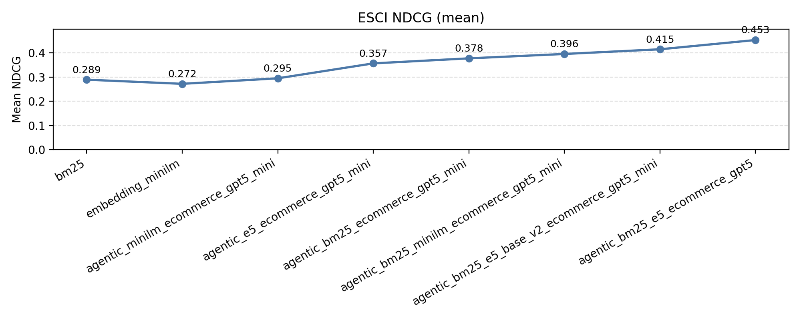
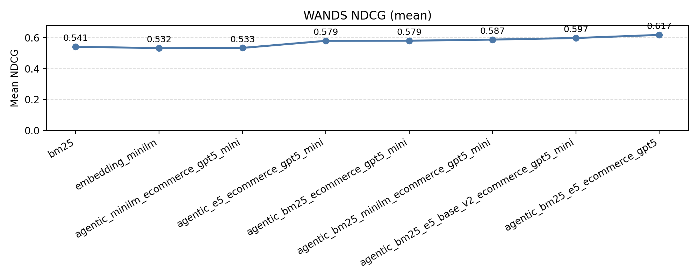

## Search experiments

Agentic search benchmarks on search datasets.

How good can just an agent do at search with just a few basic retrieval tools?

## E-commerce datasets

### The search tools

Retrieval with the following strategies available to the tools:

- e5-base-v2: [Source](https://huggingface.co/intfloat/e5-base-v2)
- minilm: [Source](https://huggingface.co/sentence-transformers/all-MiniLM-L6-v2)
- bm25 w/ std params on title and description fields.

### Amazon ESCI 

Baselines first, agentic sorted by NDCG ascending. N=1000 queries.

ESCI is Amazon's Shopping Queries dataset for product search relevance with graded labels. [Source](https://github.com/amazon-science/esci-data)

| strategy | model | mean | median |
|---|---|---|---|
| [bm25](configs/bm25.yml) | n/a | 0.2895 | 0.1707 |
| [embedding_minilm](configs/embedding_minilm.yml) | n/a | 0.2304 | 0.0854 |
| [embedding_e5](configs/embedding_e5_base_v2.yml) | n/a | 0.3142 | 0.2250 |
| [agentic_minilm_ecommerce_gpt5_mini](configs/agentic_ecom_minilm_gpt5_mini.yml) | gpt-5-mini | 0.2952 | 0.1749 |
| [agentic_e5_ecommerce_gpt5_mini](configs/agentic_ecom_e5_base_v2_gpt5_mini.yml) | gpt-5-mini | 0.3569 | 0.3399 |
| [agentic_bm25_ecommerce_gpt5_mini](configs/agentic_ecom_bm25_gpt5_mini.yml) | gpt-5-mini | 0.3777 | 0.3414 |
| [agentic_bm25_minilm_ecommerce_gpt5_mini](configs/agentic_ecom_2tools_gpt5_mini.yml) | gpt-5-mini | 0.3958 | 0.3414 |
| [agentic_bm25_e5_base_v2_ecommerce_gpt5_mini](configs/agentic_ecom_2tools_e5_gpt5_mini.yml) | gpt-5-mini | 0.4152 | 0.3794 |
| [agentic_bm25_e5_ecommerce_gpt5](configs/agentic_ecom_2tools_gpt5.yml) | gpt-5 | 0.4535 | 0.4417 |



### Wayfair WANDS

Baselines first, agentic sorted by NDCG ascending.

WANDS is Wayfair's product search relevance dataset with graded judgments. [Source](https://github.com/wayfair/WANDS)

| strategy | model | mean | median |
|---|---|---|---|
| [bm25](configs/bm25.yml) | n/a | 0.5408 | 0.4746 |
| [embedding_minilm](configs/embedding_minilm.yml) | n/a | 0.5060 | 0.4083 |
| [embedding_e5](configs/embedding_e5_base_v2.yml) | n/a | 0.5571 | 0.5475 |
| [agentic_minilm_ecommerce_gpt5_mini](configs/agentic_ecom_minilm_gpt5_mini.yml) | gpt-5-mini | 0.5330 | 0.4874 |
| [agentic_e5_ecommerce_gpt5_mini](configs/agentic_ecom_e5_base_v2_gpt5_mini.yml) | gpt-5-mini | 0.5789 | 0.5609 |
| [agentic_bm25_ecommerce_gpt5_mini](configs/agentic_ecom_bm25_gpt5_mini.yml) | gpt-5-mini | 0.5795 | 0.5609 |
| [agentic_bm25_minilm_ecommerce_gpt5_mini](configs/agentic_ecom_2tools_gpt5_mini.yml) | gpt-5-mini | 0.5867 | 0.5609 |
| [agentic_bm25_e5_base_v2_ecommerce_gpt5_mini](configs/agentic_ecom_2tools_e5_gpt5_mini.yml) | gpt-5-mini | 0.5970 | 0.5609 |
| [agentic_bm25_e5_ecommerce_gpt5](configs/agentic_ecom_2tools_gpt5.yml) | gpt-5 | 0.6171 | 0.6256 |



## Run a strategy

```bash
uv run run --strategy configs/agentic_ecom_minilm_gpt5_mini.yml --dataset wands --num-queries 1000
```
