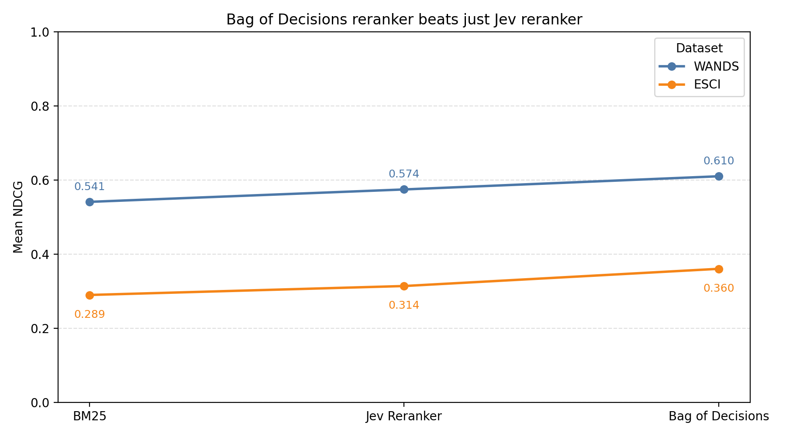

# E-commerce BM25 and bag-of-decisions variants

> **Note:** This document was generated by an LLM.

## Experiment setup

This experiment compares three retrieval variants on WANDS and Amazon ESCI:

| Dataset | Queries | Seed |
| --- | ---: | ---: |
| WANDS | 480 | 42 |
| ESCI | 1,000 | 42 |

The commands below run each variant directly from the repository root and use
8 workers. The comparison script defaults to 16 workers (`WORKERS` can override
it); the runner summary CSV does not record the worker count.

## Results



The full machine-readable results, including serialized strategy parameters,
are in [`research/results/ecom_decisions_variants.csv`](../results/ecom_decisions_variants.csv).
All six rows report `NDCG` and were run at commit
`8734fde3b23ce17eafdf60b2f55dfa6bced47e43`.

| Dataset | Variant | Mean NDCG | Median NDCG | Config |
| --- | --- | ---: | ---: | --- |
| WANDS | BM25 | 0.5407553553417934 | 0.47461951858375095 | [`bm25.yml`](../../configs/ecom_base/bm25.yml) |
| WANDS | Jev Reranker | 0.5742621821794697 | 0.5609447680982702 | [`bag_of_decisions_direct.yml`](../../configs/ecom_decisions/bag_of_decisions_direct.yml) |
| WANDS | Bag of Decisions | 0.6098137673305334 | 0.5609447680982702 | [`bag_of_decisions.yml`](../../configs/ecom_decisions/bag_of_decisions.yml) |
| ESCI | BM25 | 0.28947299049683545 | 0.17070857607370277 | [`bm25.yml`](../../configs/ecom_base/bm25.yml) |
| ESCI | Jev Reranker | 0.3136213056689957 | 0.2048502912884433 | [`bag_of_decisions_direct.yml`](../../configs/ecom_decisions/bag_of_decisions_direct.yml) |
| ESCI | Bag of Decisions | 0.36007937368146015 | 0.34141707368146015 | [`bag_of_decisions.yml`](../../configs/ecom_decisions/bag_of_decisions.yml) |

## Variants

### BM25 baseline

Uses the existing [`configs/ecom_base/bm25.yml`](../../configs/ecom_base/bm25.yml)
configuration. It ranks products lexically with BM25, using title boost 9.3 and
description boost 4.1 (`k1: 1.2`, `b: 0.75`). It does not call a decision model.

```bash
uv run run --strategy configs/ecom_base/bm25.yml --dataset wands --num-queries 480 --seed 42 --workers 8
uv run run --strategy configs/ecom_base/bm25.yml --dataset esci --num-queries 1000 --seed 42 --workers 8
```

### Direct Jev decision

Uses [`configs/ecom_decisions/bag_of_decisions_direct.yml`](../../configs/ecom_decisions/bag_of_decisions_direct.yml).
BM25 first retrieves candidates. For each query, Jev evaluates the same configured
Noul question against the query and each candidate product. The configured true
and false criteria explain what counts as a match. All Noul `P(yes)` values are
summed, multiplied by 10, and added to the original retrieval score. The top 100
BM25 candidates are evaluated.

```bash
uv run run --strategy configs/ecom_decisions/bag_of_decisions_direct.yml --dataset wands --num-queries 480 --seed 42 --workers 8
uv run run --strategy configs/ecom_decisions/bag_of_decisions_direct.yml --dataset esci --num-queries 1000 --seed 42 --workers 8
```

### LLM-generated bag of decisions

Uses [`configs/ecom_decisions/bag_of_decisions.yml`](../../configs/ecom_decisions/bag_of_decisions.yml).
GPT-5 generates query-specific yes/no questions. Jev evaluates those questions
against each of the top 100 BM25 candidate products; all questions for one
candidate are sent in a single request. All Noul `P(yes)` values are summed,
multiplied by 10, and added to the original retrieval score.

```bash
uv run run --strategy configs/ecom_decisions/bag_of_decisions.yml --dataset wands --num-queries 480 --seed 42 --workers 8
uv run run --strategy configs/ecom_decisions/bag_of_decisions.yml --dataset esci --num-queries 1000 --seed 42 --workers 8
```

## Run the full comparison

The script runs the six dataset/variant combinations, writes one summary row per
combination to `research/results/ecom_decisions_variants.csv`, and creates
`assets/ecom_decisions_variants.png`:

```bash
./scripts/run_ecom_decisions_variants.sh
```

The script uses cached strategy results by default. Set `WORKERS`, `SEED`,
`WANDS_NUM_QUERIES`, or `ESCI_NUM_QUERIES` to override its defaults. The CSV and
plot paths can be changed with `RESULTS_CSV` and `PLOT_OUTPUT`.
